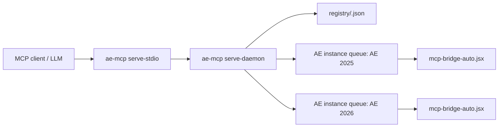

# MCP Tool再構成案: JSX実行中心設計

- 作成日: 2026-05-11
- 対象: `ae-mcp` / After Effects連携
- 目的: LLMが扱いやすいようにMCP公開面を絞り、After Effects操作はJSX実行に寄せる

## 結論

第一段階では、公開toolを「JSX実行ランタイム」と少数の補助toolに絞る。

- AE操作の主経路は `run-jsx` / `run-jsx-file` にする。
- `mode` と `description` は必須にする。
- 任意JSXは最初から `unsafe` として扱う。
- 個別AE操作toolは非公開化またはdeprecated化する。
- `ae_command.json` は廃止する方向にする。
- キューファイルも作らず、Rust側FIFOとrequest registryで単一実行を管理する。
- タイムアウトしても `requestId` で後から結果確認できるようにする。
- 実行中JSXの強制停止は基本的に保証しない。中断は協調的キャンセルとして設計する。

## 背景

現状の `ae-mcp` は、After Effects操作ごとに個別MCP toolを公開している。

- `create-composition`
- `apply-effect`
- `project-save`
- `render-queue-add`
- `set-current-time`
- `mcp_aftereffects_*`
- など

一方、実際のAE操作は最終的に `mcp-bridge-auto.jsx` 内のExtendScript関数へ委譲される。LLMもJSXを書いて操作する傾向があるため、個別toolを増やすより、公開toolを「JSX実行ランタイム」として整理した方が見通しが良い。

## 推奨する公開Tools

| Tool | 役割 | 備考 |
|---|---|---|
| `run-jsx` | 文字列で渡されたJSXをAEで実行 | 主経路。同期実行が基本 |
| `run-jsx-file` | 外部 `.jsx` ファイルをAEで実行 | path/hash検証は可能。ただし任意コードならunsafe |
| `get-jsx-result` | `requestId` から結果または現在状態を取得 | タイムアウト後の再確認用 |
| `cancel-jsx-request` | queued/running requestのキャンセル要求 | running中は協調的キャンセルのみ |
| `get-capabilities` | ブリッジ状態、AE状態、許可状態を返す | 新設候補 |
| `get-help` | 運用ルールとJSX規約を返す | LLM向け |
| `save-frame-png` | 単一フレームPNG保存 | 高頻度かつ専用化価値あり |
| `cleanup-preview-folder` | previewファイル削除 | AE外のファイル操作なので残す |
| `run-bridge-test` | ブリッジ疎通確認 | テスト用 |

候補として残すが、第一段階では必須ではないtool:

| Tool | 役割 | 注意 |
|---|---|---|
| `list-jsx-requests` | request registryの一覧 | デバッグ用 |
| `undo-last-jsx` | 直近JSX実行のUndoを試みる | best effort |
| `redo-last-jsx` | Redoを試みる | best effort |

非公開化候補:

- `create-composition`
- `setLayerKeyframe`
- `setLayerExpression`
- `apply-effect`
- `apply-effect-template`
- `list-supported-effects`
- `describe-effect`
- `render-queue-*`
- `set-current-time`
- `get-current-time`
- `set-work-area`
- `get-work-area`
- `project-*`
- `application-quit`
- `mcp_aftereffects_*`

既存クライアント互換のため、すぐ削除せず以下の段階移行が安全。

1. `tools/list` から隠すが内部dispatchは残す。
2. `deprecated`扱いのヘルプ文を返す。
3. 次のbreaking versionで削除する。

## `run-jsx` の引数案

```json
{
  "code": "function main(args) { return { status: 'success', result: {} }; } main(args);",
  "args": {},
  "mode": "unsafe",
  "description": "短い実行目的",
  "timeoutMs": 10000,
  "undoGroup": true,
  "resultRetentionSeconds": 3600
}
```

### フィールド

| フィールド | 必須 | 内容 |
|---|---:|---|
| `code` | yes | 実行するJSX文字列 |
| `mode` | yes | 実行ポリシー。任意JSXは `unsafe` 固定 |
| `description` | yes | 監査ログ、Undo group名、ユーザー説明に使う |
| `args` | no | JSXへ渡すJSON引数 |
| `timeoutMs` | no | MCP呼び出しが待つ最大時間 |
| `undoGroup` | no | `app.beginUndoGroup(description)` でwrapするか |
| `resultRetentionSeconds` | no | 結果・状態をrequest registryに残す秒数。上限を超える値はreject |

`wait` は原則不要。同期実行を基本にし、待ちきれない場合はtimeoutとして返す。

`resultRetentionSeconds` は上限を設定する。推奨既定値は `3600` 秒、推奨上限は `86400` 秒。上限を超えた値は丸めず、schema/validation errorとして弾く。

## `run-jsx-file` の引数案

```json
{
  "path": "C:\\path\\to\\script.jsx",
  "args": {},
  "mode": "unsafe",
  "description": "外部JSXファイルの実行",
  "timeoutMs": 10000,
  "undoGroup": true,
  "resultRetentionSeconds": 3600
}
```

### フィールド

| フィールド | 必須 | 内容 |
|---|---:|---|
| `path` | yes | 実行する `.jsx` / `.jsxbin` のパス |
| `mode` | yes | `trusted` または `unsafe` |
| `description` | yes | 監査ログ、Undo group名、ユーザー説明に使う |
| `args` | no | JSXへ渡すJSON引数 |
| `timeoutMs` | no | MCP呼び出しが待つ最大時間 |
| `undoGroup` | no | Undo groupでwrapするか |
| `resultRetentionSeconds` | no | 結果・状態をrequest registryに残す秒数。上限を超える値はreject |

`run-jsx-file` はRust側で以下を検証できる。

- 絶対パス化
- 許可ディレクトリ配下か確認
- 拡張子 `.jsx` / `.jsxbin` 制限
- ファイルサイズ上限
- ハッシュ記録
- UTF-8読み込み可否

ただし、これらは任意JSXの安全性保証ではない。事故防止と監査用のガードとして扱う。

## 実行モード

任意JSXに対して、Rust側だけで安全性を保証するのは難しい。そのため、`mode` は必須にするが、セキュリティ境界として過信しない。

| mode | 対象 | 意味 |
|---|---|---|
| `unsafe` | 任意の文字列JSX、任意の外部JSX | ユーザー/LLMが生成したコードをそのままAE権限で実行する |
| `trusted` | 同梱済み、hash allowlist済みのJSX | リポジトリ側で管理された既知スクリプトのみ実行する |

`restricted` のような中間モードは、実際に安全境界を作れるまでは導入しない方がよい。名前だけのrestrictedは誤解を生む。

## 任意JSXの安全性

Rust側でできる検証:

- JSON schema検証
- `mode` enum検証
- `timeoutMs` の上限・下限チェック
- `code` 文字数・バイト数制限
- `path` のcanonicalize
- 許可ディレクトリ配下か確認
- 拡張子制限
- ファイルサイズ制限
- 実行ログ記録
- 実行コードのhash記録
- 危険そうな文字列の簡易lint

ただし、JS/ExtendScriptパーサーや静的解析ライブラリを使っても、任意JSXの完全な安全性保証は難しい。

理由:

- ExtendScriptは古いJS系言語で、一般的なJS parserと完全互換ではない。
- AEのhost object modelの副作用を静的解析だけで判断できない。
- `eval`、文字列連結、動的プロパティアクセス、別名参照でdenylistは回避できる。
- `File` / `Folder` / `app.project` / `app.executeCommand` などの副作用は実行時環境に依存する。
- AE内で実行される以上、OSレベルのsandboxではない。

したがって、任意JSXは最初から `unsafe` と扱う。安全境界が必要な場合は、任意JSXを許可せず、`trusted` な同梱スクリプトまたはhash allowlistだけを実行対象にする。

## command file廃止後の輸送路

`ae_command.json` を廃止する場合でも、RustからAEへ実行要求を渡す輸送路は必要になる。MCPの返り値はLLM/クライアントへ返るものであり、単独ではAEへ命令を届けられない。

推奨は、Rust側にローカルbridge endpointを持たせ、AEパネルがそこへshort pollingまたはlong pollingし、結果をpostする方式。

```text
MCP client
  -> ae-mcp run-jsx
  -> Rust request registry / FIFO
  <- AE panel waits for next request
  -> AE executes JSX
  <- AE posts result to Rust
  <- ae-mcp returns JSON to MCP client
```

この方式では以下を廃止できる。

- `ae_command.json`
- `ae_queue.jsonl`
- command上書きによる競合

結果も基本的にはRustのrequest registryからMCPへ直接返す。必要なら、デバッグ・プロセス再起動耐性のために結果だけを短期journalとして保存する。

### JSX側endpoint/hookの可否

定期pollより「リクエスト時に即実行」できる方が理想。ただし、純粋なScriptUI/ExtendScriptだけで安定したpush型endpointを作るのは難しい。

候補は以下。

| 方式 | 即時性 | 安定性 | 推奨度 | 内容 |
|---|---:|---:|---:|---|
| AEパネル -> Rust short polling | 中 | 高 | 第一候補 | `app.scheduleTask` で短周期にRustへ問い合わせる |
| AEパネル -> Rust long polling | 高 | 中 | 検討候補 | RustへのHTTP接続を待機させ、requestが来たら返す |
| JSX側 `Socket.listen()` endpoint | 高 | 低 | 非推奨 | ExtendScriptのTCP server機能を使う |
| CEP/UXP側Node endpoint + `evalScript` | 高 | 中-高 | 将来候補 | パネルをCEP/UXP化するなら現実的 |
| 外部プロセスからAEへ直接hook | 高 | 低 | 非推奨 | AE側に安定した汎用受信hookがない |

ExtendScriptには `Socket` があり、`listen()` と `poll()` で簡易TCP serverを作ること自体は可能。ただしHTTP実装を自前で持つ必要があり、ブロッキング、OS差、AEホスト差、permission、エラー復旧の扱いが難しい。Mac環境で `Socket.listen()` が不安定という報告もあるため、クロスプラットフォームの基盤としては避ける。

第一候補はlong polling。AE側からRustへ接続する向きは現在の「AEが外へ取りに行く」モデルと近く、ファイアウォールや受信ポートの問題を避けやすい。Rust側はrequestが来るまでHTTPレスポンスを保留し、AE側はレスポンスを受け取ったら即実行して結果をpostする。

long pollingの注意点:

- ExtendScriptのSocket/HTTP client実装が低レベルなため、実装量は増える。
- 接続待機中にScriptUIやAE操作が固まらないか検証が必要。
- `app.scheduleTask` で「短いlong pollを繰り返す」方式が現実的。
- 失敗時はshort pollingへfallbackする。

現実的な段階案:

1. まずshort pollingをRust endpoint方式で実装する。
2. intervalを短めにし、requestがない時は軽く返す。
3. 安定後、long polling modeを追加して即時性を改善する。
4. JSX側listener方式は採用しない。ただし実験メモとして残す。

## Rust側FIFO同期実行

### 目標

- `run-jsx` / `run-jsx-file` は同期実行を基本にする。
- 並列に呼ばれた場合、Rust側FIFOで後続requestを待機させる。
- AE側では常に1件ずつ実行する。
- 呼び出し元には自分の `requestId` に対応する結果だけ返す。
- タイムアウトしてもrequest registryには状態を残す。
- timeout後は `get-jsx-result` で再確認できる。

### 基本フロー

1. `run-jsx` 呼び出しを受ける。
2. Rustが `requestId` を発行する。
3. request registryに `queued` として登録する。
4. FIFOの先頭requestのみAEへ配信可能にする。
5. AEパネルがRust endpointをpollし、requestを取得する。
6. Rustは状態を `dispatched` または `running` にする。
7. AEパネルがJSXを実行する。
8. AEパネルがRustへ結果をpostする。
9. Rustはrequest registryを `completed` / `failed` に更新する。
10. 待機中のMCP呼び出しがまだ生きていれば、その場でJSON結果を返す。
11. 待機がtimeout済みなら、後続の `get-jsx-result` で取得できるよう保持する。

### request状態

| state | 意味 |
|---|---|
| `queued` | Rust内FIFOで待機中 |
| `dispatched` | AEパネルへ渡した |
| `running` | AE側が実行開始をackした |
| `completed` | 成功結果あり |
| `failed` | 実行エラーあり |
| `timeout` | MCP呼び出しの待機時間を超えた。ただし実行自体は継続している可能性あり |
| `cancelRequested` | キャンセル要求済み |
| `cancelled` | queued中に削除、または協調的キャンセルで停止 |
| `lost` | AE終了、bridge切断、再起動などで結果取得不能の可能性が高い |

`timeout` は「MCP呼び出しが待ちきれなかった」状態であり、「AE実行が止まった」ことを意味しない。

## `get-jsx-result`

タイムアウト後に結果を確認するtoolを用意する。

```json
{
  "requestId": "01H...",
  "waitMs": 0
}
```

返却例:

```json
{
  "requestId": "01H...",
  "state": "completed",
  "result": {
    "status": "success",
    "result": {}
  },
  "startedAt": "2026-05-11T00:00:00Z",
  "completedAt": "2026-05-11T00:00:02Z"
}
```

`waitMs` を指定した場合は、短時間だけ結果到着を待ってから返す。

## タイムアウト設計

### タイムアウト種別

| 種別 | 判定 | 返すべき内容 |
|---|---|---|
| `queueTimeout` | FIFO待機中にtimeout | まだAEへ渡っていない |
| `dispatchTimeout` | AEパネルがrequestを取りに来ない | パネル未起動、Auto-run停止、bridge通信不良 |
| `runningTimeout` | AE実行開始後に結果が返らない | AE処理中、modal dialog、JSX停止、AEクラッシュ疑い |
| `bridgeOffline` | heartbeatが古い | AEパネル未起動または停止 |
| `lost` | AEが落ちた、またはbridge再接続後も該当request不明 | 結果取得不能の可能性が高い |
| `executionError` | JSX側例外 | message / line / fileName |

### `run-jsx` timeout返却例

```json
{
  "status": "error",
  "errorType": "runningTimeout",
  "requestId": "01H...",
  "state": "running",
  "message": "Timed out while waiting for AE to return a result. Use get-jsx-result with requestId to check the result later.",
  "timeoutMs": 10000
}
```

timeout時は、queued requestを自動削除するかどうかを慎重に扱う。推奨は以下。

- `queued` のままtimeoutした場合: `cancelOnTimeout` がtrueなら削除、既定では保持。
- `dispatched` / `running` でtimeoutした場合: 実行継続とみなし、registryに保持。
- `bridgeOffline` の場合: requestは保持するが、`get-capabilities` で復旧状態を確認できるようにする。

## キャンセル・一時中断

### できること

| 状態 | キャンセル可否 | 内容 |
|---|---|---|
| `queued` | 可能 | FIFOから削除して `cancelled` にする |
| `dispatched` | 場合による | AEがまだ開始していなければ無視させる |
| `running` | 協調的にのみ可能 | 実行中JSXがキャンセル確認を行う場合だけ止められる |

### できないこと

実行中のExtendScriptをRust側から安全に強制停止することは基本的に期待しない。AE側のスクリプト実行は単一スレッド的に扱われ、長時間同期処理中はパネル側も次の命令を処理できない可能性がある。

### 協調的キャンセル

長時間処理を想定するJSXには、wrapperからキャンセル確認APIを提供する。

```javascript
function main(args, mcp) {
  for (var i = 0; i < args.items.length; i++) {
    if (mcp.shouldCancel()) {
      return { status: "cancelled", processed: i };
    }
    // chunk処理
  }
  return { status: "success" };
}
```

`pause` / `resume` も同様に、chunk化されたJSXが協調的に実装する場合だけ可能。第一段階では `cancel-jsx-request` までを実装対象にし、pause/resumeは将来候補でよい。

## Undo / Redo

`run-jsx` / `run-jsx-file` は既定で以下のようにwrapする。

```javascript
app.beginUndoGroup(description);
try {
  // user JSX
} finally {
  app.endUndoGroup();
}
```

これにより、AEのUndo stack上では1つの操作としてまとまりやすくなる。

注意:

- すべての副作用がUndo可能とは限らない。
- ファイル操作、外部書き込み、レンダー、アプリ終了などはUndo対象外になりうる。
- ユーザーが手動操作を挟むと「直近JSX」のUndo保証は崩れる。
- AEがクラッシュした場合、Undo stackは期待できない。

`undo-last-jsx` / `redo-last-jsx` を追加する場合はbest effort扱いにする。安全保証や完全なロールバック機構として扱わない。

## Auto-run問題への対応

`mcp-bridge-auto.jsx` のAuto-runが不安定な場合、Rust側だけでは根本解決できない。JSX側で状態観測と自己回復を増やす。

### JSX側で改善したい点

1. `#targetengine "ae_mcp_bridge"` を使い、ScriptUI実行エンジンを固定する。
2. poll関数を `$.global` に明示的に生やし、`app.scheduleTask` から確実に呼べるようにする。
3. heartbeatをRust bridgeへ定期送信する。
4. Auto-run ON/OFF、permission状態、lastPollAt、lastErrorをstatusとして返す。
5. request取得、実行開始ack、結果postをrequestId単位で扱う。
6. JSON parse失敗時は該当requestを `failed` として返す。
7. modal dialog検出時は `running` のままstatusに理由を出すか、協調的にretryする。
8. パネル起動直後にpermissionを検査し、NGならstatusへ理由を書く。

### status情報

`get-capabilities` は以下を返す。

```json
{
  "bridge": {
    "online": true,
    "lastHeartbeatAt": "2026-05-11T00:00:00Z",
    "autoRun": true,
    "fileNetworkPermission": true
  },
  "afterEffects": {
    "available": true,
    "version": "unknown"
  },
  "currentRequest": {
    "requestId": "01H...",
    "state": "running",
    "description": "..."
  }
}
```

## Resourcesの再構成

`resources` はLLMが参照する文脈データとして使う。

| Resource | 内容 |
|---|---|
| `aftereffects://jsx/conventions` | JSX実行規約 |
| `aftereffects://jsx/examples` | コンポ作成、レイヤー操作、エフェクト適用例 |
| `aftereffects://effects/catalog` | 既知effect matchName一覧 |
| `aftereffects://project/compositions` | 現在のコンポ一覧 |
| `aftereffects://bridge/status` | ブリッジ状態 |

`resources/read` がAEへ問い合わせる場合も、Rust側FIFOを通す。これによりtool実行との競合を避ける。

## Promptsの再構成

MCPにおける `prompts` は、モデルが自動実行するtoolではなく、ユーザーが選ぶ再利用可能な作業テンプレートとして扱う。

| Prompt | 内容 |
|---|---|
| `write-jsx-for-ae-task` | ユーザー要求からJSXを作り、必要なら `run-jsx` で実行する |
| `inspect-project-with-jsx` | プロジェクト、コンポ、レイヤー情報をJSXで調査する |
| `apply-effect-with-jsx` | matchName確認、エフェクト適用、結果確認の流れ |
| `save-preview-frame` | `save-frame-png` を使ったプレビュー保存 |
| `safe-project-save` | 非対話保存ルールを含む保存手順 |
| `debug-bridge` | timeout、permission、heartbeat、request状態の調査手順 |

Promptsはtool数を減らした後の「使い方の足場」として有効。

## 移行ステップ案

1. `mode` / `description` 必須の `run-jsx` / `run-jsx-file` schemaを追加する。
2. Rust側にrequest registryとFIFOロックを追加する。
3. Rust側にローカルbridge endpointを追加する。
4. AEパネルを `ae_command.json` pollingからRust endpoint pollingへ移行する。
5. `requestId` 付きの結果postと `get-jsx-result` を追加する。
6. `cancel-jsx-request` を追加する。
7. heartbeat/statusを追加し、`get-capabilities` から見えるようにする。
8. `app.beginUndoGroup(description)` wrapperを追加する。
9. `resources` にJSX規約と例を追加する。
10. `prompts` をJSX中心のレシピに再構成する。
11. 既存個別toolsを `tools/list` から隠す。
12. 互換期間後にdeprecated toolsを削除する。

## 実装上の注意

- `ae_command.json` を廃止するなら、RustとAEの通信はローカルHTTP/Socketなどに置き換える必要がある。
- Rust側FIFOはMCP serverプロセス内では単一保証しやすい。
- 複数 `ae-mcp` プロセスを許容するなら、ポート占有またはプロセスロックで二重起動を防ぐ。
- request registryはmemory-firstでよいが、timeout後の結果確認を安定させるなら短期journalも検討する。
- 任意JSXは常にunsafeとして扱い、下手に「安全そうなmode」を作らない。

## 実装メモ: file-based broker v1

今回の実装では、本格的なdaemon IPC化の前段階として `bridge-core` に file-based broker を追加した。

### 追加した要素

- `instances/<instanceId>/heartbeat.json`
  - AEパネルごとの生存確認とバージョン情報。
  - `appVersion` / `displayName` / `projectPath` / `status` / `currentRequestId` を含む。
- `instances/<instanceId>/ae_command.json`
  - AEインスタンス専用のcommand file。
  - 共有 `ae_command.json` の上書き競合を避ける。
- `instances/<instanceId>/ae_mcp_result.json`
  - AEインスタンス専用のresult file。
  - 結果には `_requestId` / `_commandExecuted` / `_aeInstance` を付与する。
- `registry/<requestId>.json`
  - timeout後の再確認用request registry。
  - `queued` / `dispatched` / `running` / `completed` / `failed` / `timeout` / `lost` を保持する。
- `broker.lock`
  - 複数 `serve-stdio` プロセスからの同時書き込みを抑止するprocess間ロック。

### target解決

- `targetInstanceId` が指定された場合は、そのAE instanceに送る。
- `targetVersion` が指定された場合は、`appVersion` または `displayName` で絞り込む。
- target未指定の場合:
  - active instanceが1件なら自動選択する。
  - active instanceが0件ならエラー。
  - active instanceが複数件ならエラーにし、`targetInstanceId` または `targetVersion` を要求する。

### 現時点の制約

- `serve-daemon` はまだ本格broker IPCとしては使っていない。
- v1は `bridge-core` の file lock と registry による安全化。
- process間の厳密なFIFO順序はOSのlock取得順に依存するため、完全なfair queueではない。
- ただし同一AE instanceへのcommand/result上書き競合は避ける。
- 異なるAE instanceの完全並列実行はまだ優先していない。global `broker.lock` により安全側に倒している。
- AEに渡した後にtimeoutしたrequestは実行継続扱い。後続requestは `current_request.json` を見て、完了・lost判定まで待つ。

### 次段階

本格的にdaemon brokerへ移す場合は、`serve-daemon` にローカルIPCを持たせ、`serve-stdio` はdaemonへproxyする。これによりメモリ上のfair FIFO、AE instanceごとの並列キュー、より明確なcancel制御を実装できる。

## 実装メモ: daemon broker v2

file-based broker v1は移行用の土台として残しつつ、MCP通常経路は `serve-daemon` brokerへ寄せる。

### 通信経路



`serve-stdio` は実行系toolをローカルdaemonへproxyする。daemonが起動していない場合は、実行系toolはdaemon接続エラーを返す。

### daemonの責務

- request受付
- `requestId` 発行とregistry作成
- `targetInstanceId` / `targetVersion` によるtarget解決
- AE instanceごとのworker queue作成
- 同一AE instance内のFIFO実行
- 別AE instance間の並列実行
- `globalExclusive` requestの全instance排他
- timeout後の `get-jsx-result` 用registry更新

### FIFOと並列性

- AE instanceごとに `std::sync::mpsc` channel workerを持つ。
- channel投入順に処理するため、同一AE instance内はFIFO。
- 別AE instanceは別workerなので並列に動く。
- `cleanup-preview-folder` は `globalExclusive=true` で投入し、全worker共有の `RwLock` write lockを取る。
- 通常requestは同じ `RwLock` のread lockを取るため、global exclusive中は全通常requestも待機する。

### 現時点の制約

- daemon IPCはローカルTCPの1行JSON request/response。
- 認証は未実装。listen先は既定で `127.0.0.1:47655`。
- queued中にMCP呼び出しがtimeoutした場合、registryは一度 `timeout` になるが、workerが後で実行・完了すれば `completed` / `failed` に更新される。
- file-based `broker.lock` 経路は互換・CLI用に残すが、MCP通常経路では使わない。
